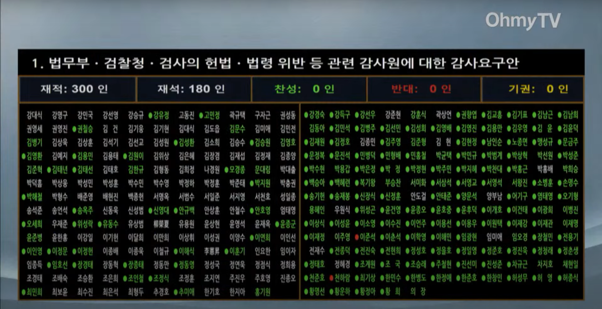
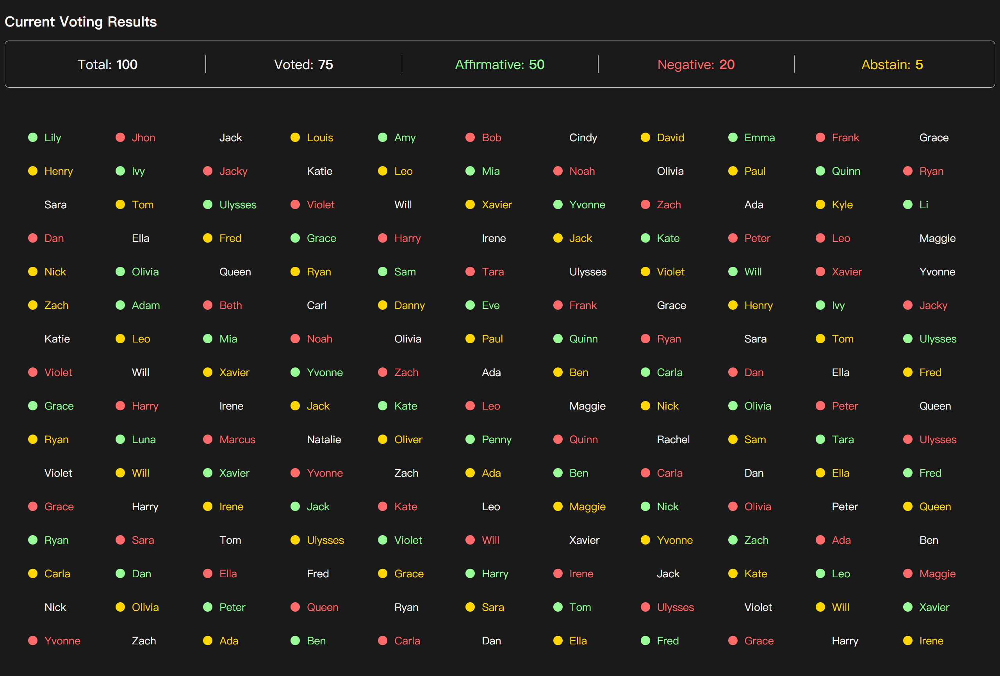

# Simple Vote Statistics Web

EN | [简体中文](doc/ZH_CN.md)

## Introduction
90% of the code in this project was completed by AI

Imitation of [South Korea's parliament martial law impeachment vote](https://www.youtube.com/watch?v=SxVxoKHT2Ro) statistics display style

## Result

## Framework&Toolchain

[Vue.js](https://vuejs.org/) x [Vite](https://vite.dev/)
