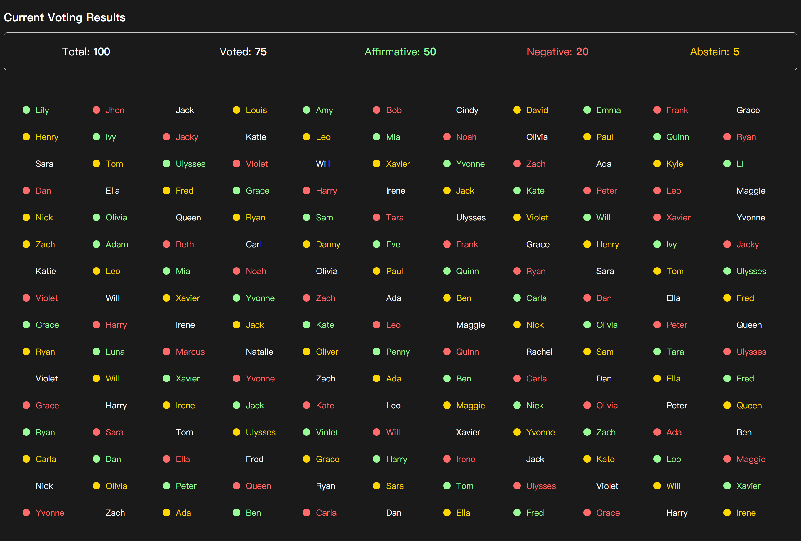

# 简单的投票数据展示网页

[EN](../README.md) | 简体中文

## 介绍
本项目80%的代码由AI完成

模仿[韩国国会戒严弹劾投票](https://www.youtube.com/watch?v=SxVxoKHT2Ro)统计显示风格

## 结果展示

## 框架与工具链

[Vue.js](https://vuejs.org/) x [Vite](https://vite.dev/)
